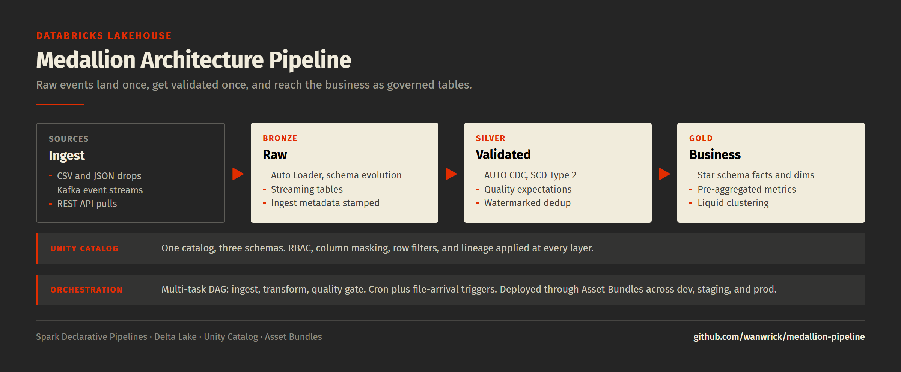

# 🏗️ Medallion Architecture Pipeline — Databricks Lakehouse

> A production-grade data pipeline implementing the **Bronze → Silver → Gold** medallion architecture on Databricks using Spark Declarative Pipelines (DLT), Unity Catalog governance, and multi-task job orchestration, with the observability dashboard that watches it.

[](https://github.com/wanwrick/medallion-pipeline/actions/workflows/tests.yml)



---

## 🎯 What This Demonstrates

- **Medallion Architecture**: Three-layer data refinement pattern (raw → validated → business-ready)
- **Spark Declarative Pipelines (DLT)**: Streaming and batch ingestion with Auto Loader
- **Change Data Capture (CDC)**: Tracking and applying incremental changes with AUTO CDC
- **Unity Catalog Governance**: Fine-grained access control, lineage tracking, and audit logging
- **Job Orchestration**: Multi-task DAG with conditional execution and event-driven triggers
- **Asset Bundles (DAB)**: Multi-environment deployment (dev → staging → prod)
- **Data Quality Checks**: Expectation-based quality enforcement at every layer

---

## 📐 Architecture

```
                         Databricks Workspace
  +-----------+     +-----------+     +-----------+     +-----------+
  |  Sources  |---->|  BRONZE   |---->|  SILVER   |---->|   GOLD    |
  |           |     |  (Raw)    |     |(Validated)|     |(Business) |
  | - CSV     |     |           |     |           |     |           |
  | - JSON    |     | Auto      |     | CDC +     |     | Star      |
  | - Kafka   |     | Loader    |     | SCD Type2 |     | Schema    |
  | - API     |     | Streaming |     | Quality   |     | Aggregates|
  +-----------+     +-----------+     +-----------+     +-----------+

  +---------------------------------------------------------------+
  |                        Unity Catalog                          |
  |   Catalog: medallion_demo                                     |
  |   Schemas: bronze | silver | gold                             |
  |   Access:  RBAC + Column Masking + Row Filters                |
  +---------------------------------------------------------------+

  +---------------------------------------------------------------+
  |                      Job Orchestration                        |
  |   Task 1: Ingest --> Task 2: Transform --> Task 3: Quality    |
  |   Trigger: Scheduled (cron) + File Arrival                    |
  +---------------------------------------------------------------+
```

---

## 📁 Project Structure

```
medallion-pipeline/
├── notebooks/
│   ├── 01_bronze_ingestion.py       # Auto Loader + streaming tables
│   ├── 02_silver_transformation.py  # CDC, SCD Type 2, quality checks
│   ├── 03_gold_aggregation.py       # Star schema + business metrics
│   ├── 04_data_quality_checks.py    # Expectation-based validation
│   └── 05_setup_sample_data.py      # Generate sample ecommerce data
├── config/
│   ├── pipeline_config.yaml         # DLT pipeline configuration
│   ├── job_config.yaml              # Multi-task job DAG
│   └── databricks.yml               # Asset Bundle (DAB) config
├── dashboard/                       # AI/BI observability layer
│   ├── queries/                     # 8 SQL widgets, 01 to 08
│   └── config/
│       ├── dashboard_config.json    # AI/BI Dashboard layout
│       ├── alerts.yaml              # Thresholds, owners, mute windows
│       └── databricks.yml           # Asset Bundle for the dashboard
├── tests/
│   ├── conftest.py                  # Notebook AST parser + Spark fixture
│   ├── test_bronze.py               # Raw-layer contract (lineage, no filtering)
│   ├── test_silver.py               # Expectation coverage + rules executed
│   ├── test_gold.py                 # Star schema shape + layer boundaries
│   └── test_dashboard.py            # SQL, YAML, and alert wiring validation
├── .github/workflows/tests.yml      # CI: pytest on every push
├── docs/
│   ├── architecture.png
│   └── dashboard.png
├── requirements.txt
└── README.md
```

---

## 🚀 Quick Start

### Prerequisites
- Databricks workspace (Community Edition works)
- Databricks CLI configured (`databricks auth login`)
- Python 3.11+

### Setup

```bash
# 1. Clone this repo
git clone https://github.com/wanwrick/medallion-pipeline.git
cd medallion-pipeline

# 2. Install dependencies
pip install -r requirements.txt

# 3. Configure your workspace
cp config/databricks.yml.example config/databricks.yml
# Edit with your workspace URL and catalog name

# 4. Generate sample data
databricks workspace import notebooks/05_setup_sample_data.py /Users/you/medallion-pipeline/

# 5. Create and run the DLT pipeline
databricks pipelines create --json config/pipeline_config.yaml
databricks pipelines start-update --pipeline-id <your-pipeline-id>
```

---

## 🧪 Tests

```bash
pip install -r requirements.txt
pytest tests -q        # 65 tests, ~20s
```

DLT notebooks cannot be imported outside a Databricks runtime, so the suite
reads the notebook source and inspects it with `ast`. That keeps it runnable on
any laptop while still catching the failures that actually occur:

| Test group | What it prevents |
|------------|------------------|
| Layer boundaries | A gold aggregate sourced from bronze, skipping every silver expectation |
| Lineage columns | A bad batch that cannot be traced back to its source file |
| Raw-layer purity | A filter in bronze silently dropping rows nothing downstream can recover |
| Expectation coverage | A silver table shipped with no quality rules |
| Key enforcement | A null join key that only warns instead of dropping |
| Executed rules | A rule that parses but never rejects anything, reporting a false pass |
| Dashboard wiring | An alert pointing at a query that was never written |
| Alert ownership | A critical alert routed to a chat channel nobody owns |

The executed-rules group is the useful one. It extracts each `@dlt.expect` predicate from
the source and runs it against sample rows, so a rule has to prove it rejects
what it claims to reject. Tests needing Spark skip cleanly when no JVM is
present; CI installs one and runs the full set.

---

## 📊 Sample Data: E-Commerce Domain

The pipeline processes a simulated e-commerce dataset:

| Table | Description | Volume |
|-------|-------------|--------|
| `raw_orders` | Customer order events | ~100K rows/day |
| `raw_customers` | Customer profile updates (CDC) | ~10K rows/day |
| `raw_products` | Product catalog changes | ~1K rows/day |
| `raw_clickstream` | Website interaction events | ~500K rows/day |

---

## 🔧 Key Implementation Details

### Bronze Layer — Raw Ingestion
- **Auto Loader** for incremental file ingestion with schema evolution
- **Streaming Tables** for real-time event processing
- Metadata enrichment: `_ingestion_timestamp`, `_source_file`, `_batch_id`

### Silver Layer — Validated & Enriched
- **AUTO CDC** for tracking changes in customer and product data
- **SCD Type 2** for maintaining historical customer dimension
- **Data Quality Expectations**: NOT NULL, valid ranges, referential integrity
- **Deduplication** using watermarks and windowing

### Gold Layer — Business-Ready
- **Star Schema**: Fact tables (orders, clickstream) + Dimension tables (customers, products, dates)
- **Pre-aggregated metrics**: Daily revenue, customer LTV, product performance
- **Liquid Clustering** for optimized query performance

---

## 🛡️ Governance (Unity Catalog)

```sql
-- Catalog & schema setup
CREATE CATALOG IF NOT EXISTS medallion_demo;
CREATE SCHEMA IF NOT EXISTS medallion_demo.bronze;
CREATE SCHEMA IF NOT EXISTS medallion_demo.silver;
CREATE SCHEMA IF NOT EXISTS medallion_demo.gold;

-- Row-level security on gold tables
CREATE FUNCTION gold_region_filter(region STRING)
  RETURN IF(IS_ACCOUNT_GROUP_MEMBER('north_america_team'), region = 'NA', TRUE);

-- Column masking for PII
CREATE FUNCTION mask_email(email STRING)
  RETURN CONCAT(LEFT(email, 2), '***@***', RIGHT(email, 4));
```

---

## 📊 The observability dashboard


The pipeline writes quality results to `gold.data_quality_metrics`. The
dashboard in `dashboard/` reads them. They live in one repo because they are one
system: a change to a quality check in `notebooks/04_data_quality_checks.py`
changes what the dashboard can display, and a single test run catches the drift.

| # | Query | What it answers |
|---|-------|-----------------|
| 01 | `quality_kpis` | The four header numbers, each with its own threshold |
| 02 | `freshness_monitor` | Which tables are stale, and how much of the SLA is spent |
| 03 | `completeness_trends` | Is quality drifting, or was yesterday a one-off |
| 04 | `accuracy_checks` | Do source and landed row counts still reconcile |
| 05 | `pipeline_sla` | Did we hold the promise, and when we missed, by how much |
| 06 | `failed_checks` | Which failure to work first, and which one nobody owns |
| 07 | `volume_anomalies` | Did a row count move more than three standard deviations |
| 08 | `metric_views` | The governed definitions everything above reads from |

Three are worth calling out.

**04 reconciles rather than counts.** Completeness tells you a column is
populated. It does not tell you a batch went missing. Accuracy compares source
to landed and treats anything past a 0.1% variance as a real loss.

**05 refuses to report a mean.** One four-hour outage and forty one-minute slips
average the same and mean nothing alike, so it reports the 95th percentile, the
worst miss, and how much of the monthly error budget is already spent.

**06 sorts by ownership, not severity.** A first failure is noise until it
repeats. A failure still open after three days has stopped being a quality
problem and become an ownership problem, so it sorts to the top and escalates to
the lead rather than paging the same on-call again.

Alerts carry an owner and a channel, and critical ones may not route to a chat
channel alone. An alert nobody owns gets muted within a month and stops working.

```bash
cd dashboard && databricks bundle deploy --target dev
```

---

## 📈 Metrics & Monitoring

| Metric | Target | Measurement |
|--------|--------|-------------|
| Pipeline freshness | < 15 min | Time since last Gold update |
| Data quality score | > 99.5% | Expectations pass rate |
| Processing latency | < 5 min | Bronze → Gold end-to-end |
| Row count accuracy | ±0.1% | Source vs. Gold reconciliation |

Sizing capacity against a freshness target like the first row is its own
problem, and a harder one than it looks. That analysis lives in
[pipeline-sla-capacity](https://github.com/wanwrick/pipeline-sla-capacity).

---

## 🏷️ Technologies

`Databricks` `Delta Lake` `Spark Declarative Pipelines (DLT)` `Unity Catalog` `Auto Loader` `AI/BI Dashboards` `Metric Views` `System Tables` `Python` `SQL` `Asset Bundles` `CDC` `SCD Type 2`

---

## 👤 Author

**Paroz Mehta**

[](https://linkedin.com/in/parozmehta)

Built with [Databricks AI Dev Kit](https://github.com/databricks-solutions/ai-dev-kit)
