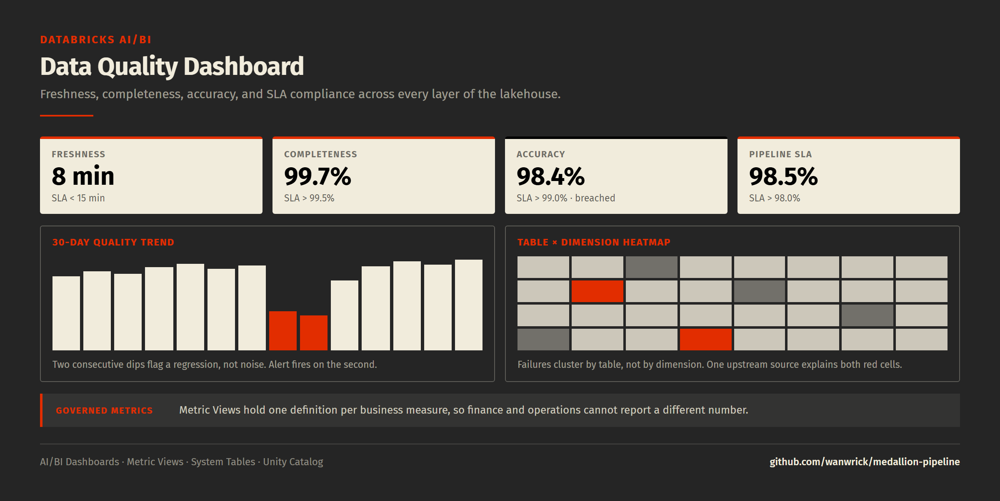

# 📊 Data Quality Dashboard — Databricks AI/BI

> A real-time data observability dashboard built on Databricks AI/BI Dashboards and Metric Views. Monitors data freshness, completeness, accuracy, and pipeline SLAs across the entire lakehouse.



---

## 🎯 What This Demonstrates

- **Data Observability**: Real-time monitoring of data quality across all layers
- **Metric Views**: Governed business metrics with consistent definitions
- **AI/BI Dashboards**: Native Databricks dashboard with KPIs, charts, and filters
- **System Tables**: Leveraging Databricks audit logs and lineage for monitoring
- **Automated Alerting**: Quality degradation detection with threshold-based alerts
- **SLA Tracking**: Pipeline freshness and delivery guarantees

---

## 📐 Architecture

```
                       Data Quality Dashboard

  +----------------------------------------------------------------+
  |                        AI/BI Dashboard                         |
  |                                                                |
  |  +-----------+ +-----------+ +-----------+ +-----------+      |
  |  | Freshness | |Completeness| | Accuracy  | | Pipeline  |      |
  |  |    KPI    | |    KPI     | |    KPI    | |  SLA KPI  |      |
  |  |  < 15 min | |   99.7%    | |   99.2%   | |   98.5%   |      |
  |  +-----------+ +-----------+ +-----------+ +-----------+      |
  |                                                                |
  |  +---------------------+  +------------------------------+    |
  |  |   Quality Trends    |  |   Table-Level Breakdown      |    |
  |  |   (Line Chart)      |  |   (Heatmap)                  |    |
  |  +---------------------+  +------------------------------+    |
  |                                                                |
  |  +----------------------------------------------------------+  |
  |  |              Failed Checks Detail Table                  |  |
  |  +----------------------------------------------------------+  |
  |                                                                |
  |  Filters: [Date Range]  [Schema]  [Quality Dimension]         |
  +----------------------------------------------------------------+

  Data Sources:
    - gold.data_quality_metrics   (quality check results)
    - gold.agg_daily_revenue      (business metric validation)
    - system.billing.usage        (compute costs)
    - system.access.audit         (governance audit trail)
```

---

## 📁 Project Structure

```
data-quality-dashboard/
├── queries/
│   ├── 01_quality_kpis.sql          # Top-level KPI counters
│   ├── 02_freshness_monitor.sql     # Table freshness tracking
│   ├── 03_completeness_trends.sql   # Null/completeness over time
│   ├── 04_accuracy_checks.sql       # Cross-table reconciliation
│   ├── 05_pipeline_sla.sql          # SLA compliance tracking
│   ├── 06_failed_checks.sql         # Detailed failure table
│   ├── 07_volume_anomalies.sql      # Row count anomaly detection
│   └── 08_metric_views.sql          # Governed metric definitions
├── config/
│   ├── dashboard_config.json        # AI/BI Dashboard layout
│   ├── alerts.yaml                  # Alert threshold configs
│   └── databricks.yml               # Asset Bundle for deployment
├── docs/
│   └── dashboard.png
└── README.md
```

---

## 🚀 Quick Start

### Prerequisites
- Databricks workspace with SQL Warehouse
- Unity Catalog enabled
- `medallion_demo` catalog with quality metrics tables (from the Medallion Pipeline project)

### Deploy Dashboard

```bash
# 1. Clone the repo
git clone https://github.com/wanwrick/data-quality-dashboard.git
cd data-quality-dashboard

# 2. Deploy using Databricks Asset Bundles
databricks bundle deploy --target dev

# 3. Or create dashboard manually via MCP
# Use the AI Dev Kit MCP server:
# create_or_update_dashboard(dashboard_config.json)
```

---

## 📋 Dashboard Widgets

### KPI Counters (Row 1)

| Widget | Query | Threshold |
|--------|-------|-----------|
| 🕐 Data Freshness | Minutes since last Gold layer update | < 15 min |
| ✅ Completeness Score | % of non-null values across critical columns | > 99.5% |
| 🎯 Accuracy Score | % of quality checks passing | > 99.0% |
| 📦 Pipeline SLA | % of pipeline runs completing on time | > 98.0% |

### Charts (Rows 2-3)
- **Quality Trend** (line chart): 30-day rolling quality scores by dimension
- **Table Heatmap**: Quality score by table × quality dimension
- **Volume Anomalies** (scatter): Tables with unexpected row count changes
- **Pipeline Runs** (bar): Daily pipeline execution status

---

## 🔧 Key Queries

### Freshness Monitor
Tracks how stale each table is relative to its SLA:

### Completeness Score
Measures null rates across critical columns with trend analysis.

### Volume Anomaly Detection
Uses statistical methods (z-score) to detect unusual row count changes.

---

## 📏 Metric Views (Governed Definitions)

Databricks Metric Views ensure consistent metric definitions:

```sql
-- Governed metric: Overall Data Quality Score
CREATE OR REPLACE METRIC VIEW medallion_demo.gold.mv_data_quality_score AS
SELECT
  checked_date,
  ROUND(AVG(CASE WHEN status = 'PASS' THEN 1.0 ELSE 0.0 END) * 100, 2) AS quality_score,
  COUNT(*) AS total_checks,
  SUM(CASE WHEN status = 'FAIL' THEN 1 ELSE 0 END) AS failed_checks
FROM medallion_demo.gold.data_quality_metrics
GROUP BY checked_date;

-- Governed metric: Pipeline Freshness
CREATE OR REPLACE METRIC VIEW medallion_demo.gold.mv_pipeline_freshness AS
SELECT
  table_name,
  MAX(checked_at) AS last_check,
  TIMESTAMPDIFF(MINUTE, MAX(checked_at), CURRENT_TIMESTAMP()) AS minutes_since_check,
  CASE
    WHEN TIMESTAMPDIFF(MINUTE, MAX(checked_at), CURRENT_TIMESTAMP()) <= 15 THEN 'ON_TIME'
    WHEN TIMESTAMPDIFF(MINUTE, MAX(checked_at), CURRENT_TIMESTAMP()) <= 60 THEN 'WARNING'
    ELSE 'BREACHED'
  END AS sla_status
FROM medallion_demo.gold.data_quality_metrics
GROUP BY table_name;
```

---

## 🚨 Alert Configuration

```yaml
# config/alerts.yaml
alerts:
  - name: "quality_score_drop"
    metric: "quality_score"
    condition: "< 98.0"
    severity: "critical"
    channels: ["email", "slack"]

  - name: "freshness_breach"
    metric: "minutes_since_check"
    condition: "> 30"
    severity: "warning"
    channels: ["slack"]

  - name: "volume_anomaly"
    metric: "row_count_zscore"
    condition: "> 3.0 OR < -3.0"
    severity: "warning"
    channels: ["email"]
```

---

## 🏷️ Technologies

`Databricks` `AI/BI Dashboards` `Metric Views` `Unity Catalog` `SQL` `Delta Lake` `Asset Bundles` `System Tables`

---

## 👤 Author

**Paroz Mehta**

[](https://linkedin.com/in/parozmehta)

Built with [Databricks AI Dev Kit](https://github.com/databricks-solutions/ai-dev-kit)
